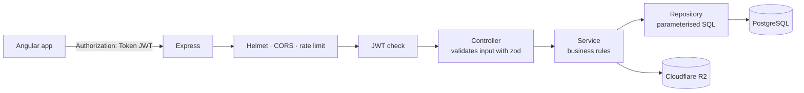
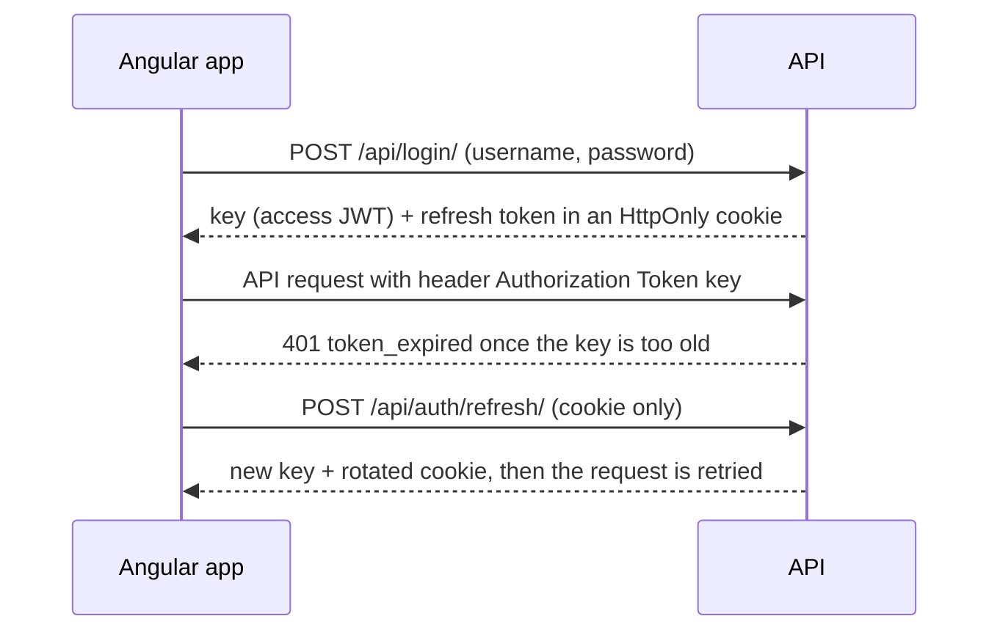

# BTC Cargo — Freight Management System

<p align="center">
  
  
</p>

A customer portal for a China → Thailand freight forwarder. Customers register parcels, follow
them through the warehouses, pay transport bills, exchange yuan and manage referral agents.

| Part | Stack | Folder |
| ---- | ----- | ------ |
| Frontend | Angular 11, TypeScript, RxJS | [`frontend/`](frontend) |
| Backend | Node.js, Express 5, TypeScript, PostgreSQL, JWT | [`backend/`](backend) |
| File storage | Cloudflare R2 (local disk until the keys are set) | — |

## Quick start

Needs Node.js 22+ and Docker.

```bash
# 1. Backend — http://localhost:3000
cd backend
cp .env.example .env      # then set TOKEN_SECRET and PASSWORD_PEPPER (32+ characters each)
docker compose up -d      # PostgreSQL on 127.0.0.1:5433
npm install
npm run migrate:up
npm run seed              # reference data, page content and the demo account
npm run watch

# 2. Frontend — http://localhost:4200
cd frontend
npm install --legacy-peer-deps
npm start
```

Open <http://localhost:4200>: it goes straight into the portal as the demo account. Log out to reach
the login and register pages; **`demo`** / **`demo1234`** signs back in.

## Backend flow

Every request passes through the same layers:



Sign-in and session renewal:



- **Access token** — a signed JWT (HS256), short-lived, sent on every request.
- **Refresh token** — random, stored hashed, rotated on every use. Presenting an old one again
  revokes the whole session.
- **Passwords** — bcrypt over an HMAC-peppered password.
- **Ownership** — every query is scoped to the user in the token; an id from the request body is
  never trusted.
- **Guest entry** — `POST /api/auth/demo/` starts the same kind of session for the seeded demo
  account, so a visitor with no session lands inside the portal instead of on the login page.
  Switch it off with `DEMO_LOGIN_ENABLED=false` (API) and `autoDemoLogin: false`
  (`frontend/src/environments`).

## What the API covers

| Area | Routes |
| ---- | ------ |
| Accounts | `/api/login`, `/api/registration`, `/api/user`, `/api/auth/*` (Google, Facebook, LINE, demo, refresh, logout) |
| Addresses, cart, catalog | `/api/address`, `/api/cart`, `/api/product` |
| Content | `/api/consent`, `/api/banner/:key`, `/api/notification/*` |
| Uploads | `/api/upload` (create, list, replace, delete), `/media/*` |
| Parcels | `/api/odoo/sale/china/tracking/*`, `/api/odoo/to/confirm` |
| Billing | `/api/odoo/sale/quotation`, `/api/odoo/payment_gateway/*`, `/api/odoo/payment/create` |
| Yuan exchange | `/api/odoo/partner/*`, `/api/odoo/currencies/*` |
| Affiliate | `/api/odoo/affiliate/*`, `/api/odoo/sale/summary`, `/api/report/:name` |
| Reference data | `/api/odoo/config/*` |

The paths and response shapes are the ones the Angular app was originally written against.

## Still to fill in

| What | Where |
| ---- | ----- |
| Cloudflare R2 keys | `backend/.env` → `R2_ACCOUNT_ID`, `R2_ACCESS_KEY_ID`, `R2_SECRET_ACCESS_KEY`, `R2_BUCKET` |
| Social login keys | `backend/.env` → `GOOGLE_CLIENT_ID`, `FACEBOOK_APP_ID`, `FACEBOOK_APP_SECRET`, `LINE_CHANNEL_ID` |
| Social login ids (frontend) | `frontend/src/environments/environment*.ts` |
| Deployed API address | `frontend/src/environments/environment.prod.ts` → `apiUrl` |

Until the R2 keys are set, uploads are written to `backend/uploads/`. Until a provider's keys
are set, its sign-in button answers "not configured".

More detail: [backend/README.md](backend/README.md) · [frontend/README.md](frontend/README.md)
