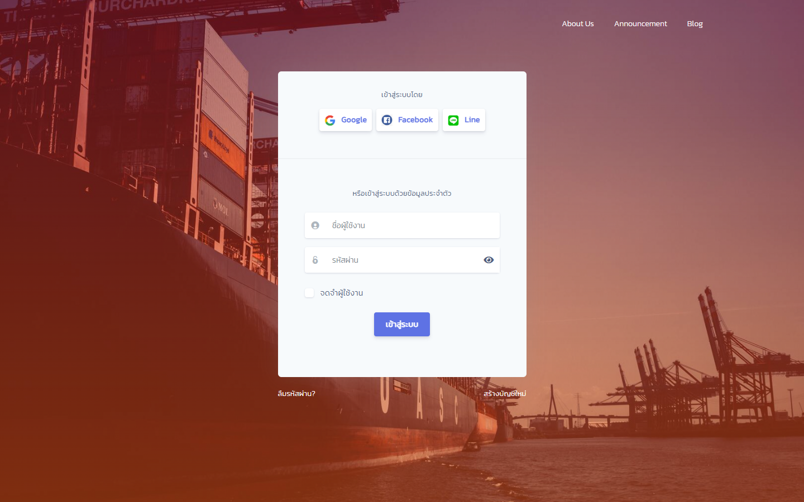
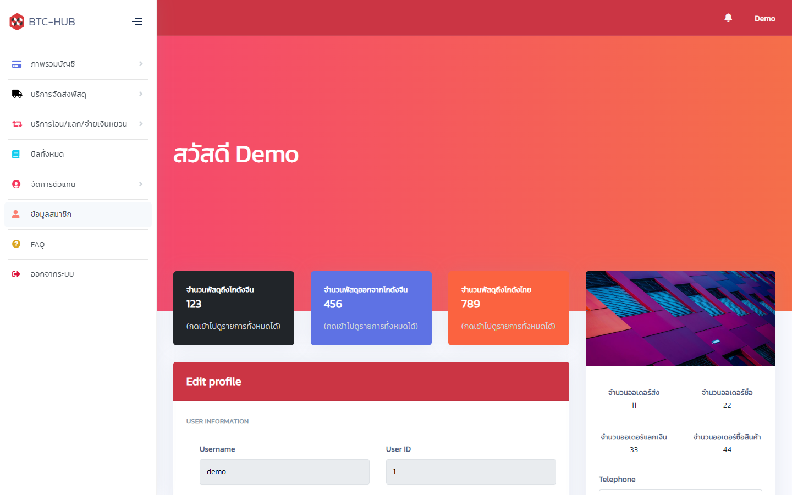

# BTC Cargo Frontend

<p align="center">
  
  
</p>

The Angular single-page application of the BTC Cargo freight management system. It talks to the
API in [`../backend`](../backend); see the [project README](../README.md) for the whole picture.

## Tech stack

- **Framework:** Angular 11, TypeScript
- **State:** RxJS observables and Angular services
- **UI:** Argon Dashboard (Bootstrap 4)

## Setup

Start the backend first (see [`../backend/README.md`](../backend/README.md)), then:

```bash
npm install --legacy-peer-deps
npm start
```

Open `http://localhost:4200`: it goes straight into the portal as the demo account. Log out to reach
the login and register pages; `demo` / `demo1234` signs back in.

- `--legacy-peer-deps` is required: the project pins `zone.js@0.10.2` while `@angular/core@11.0.5`
  asks for `~0.10.3`, and npm 7+ stops with `ERESOLVE` otherwise.
- Use `npm start`, not a bare `ng serve`. Angular 11 builds with webpack 4, which needs
  `--openssl-legacy-provider` on Node 17 and newer; the npm scripts pass it.

## Configuration

`src/environments/environment.ts` (development) and `environment.prod.ts` (production build):

| Key | What it is |
| --- | ---------- |
| `apiUrl` | Address of the backend API. `http://localhost:3000` in development |
| `autoDemoLogin` | `true`: a visitor with no session enters as the demo account. `false`: everyone signs in first |
| `googleClientId`, `facebookAppId` | Social login apps |
| `lineLoginLiffId`, `lineConnectLiffId` | LINE LIFF apps for sign-in and for connecting from the profile page |

## Production build

```bash
npm run build
```

Set `apiUrl` in `environment.prod.ts` to the deployed backend before building.
